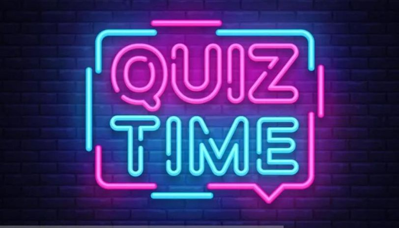

<h1 align="center">Intelloquiz
</h1>

 

<h2><b>ABOUT THE PROJECT</b></h3>

This is a quiz made using Python programming language and mysql connector(for HIghscore tables)
It consists of 3 levels.

<h2 align="center">Level 1
</h2>
 This level consists of 5 questions, with subjective answers.
 For every Right answer, you are awarded 2 points and you earn 0 points for not giving the right answer. 
 PLEASE TYPE ALL YOUR ANSWERS IN SMALL LETTER.
 
 <h2 align="center">Level 2
</h2>
This round consists of 6 MCQ Questions.
        Each correct answer will fetch you 4 points and wrong answer leads to -1 point
        
  <h2 align="center">Level 2
</h2>
This level consists of 3 questions each containing two parts.")
 If you answer the first part correct you get 5 points and a choice to play the next part or not.
 If you answer the second part correct,you win 10 points, But if you answer wrong, you get -10 points
 
 
 
 
